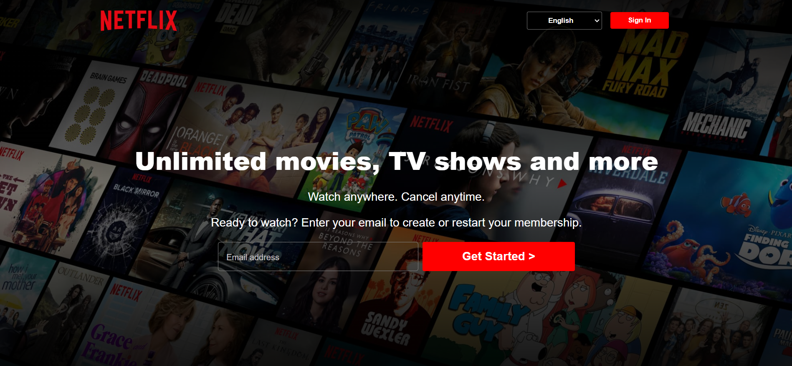
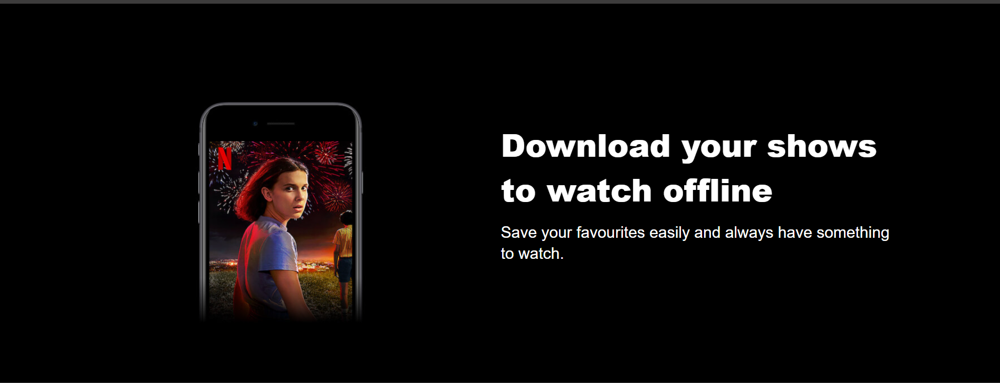
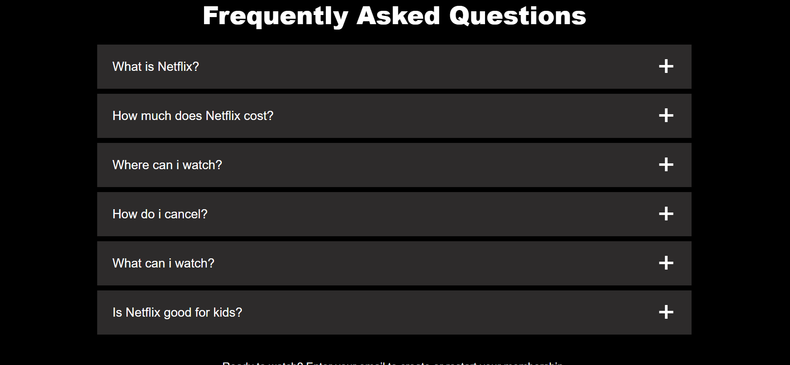
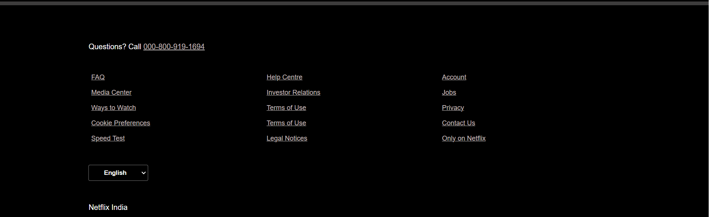

# Netflix Clone Project 

## Table of Contents

- [Introduction](#introduction)
- [Features](#features)
- [Technologies](#technologies)
- [Live-Link](#Live-link)
- [Stay-in-Touch](#Stay-in-Touch)

## Introduction

Welcome to the Netflix Clone project! This is a web application built to replicate the user interface and functionalities of the popular streaming service Netflix. The project is implemented using HTML, CSS, and JavaScript, providing users with an immersive outlook similar to Netflix's website.

**Note**: This is a purely educational and non-commercial project intended to showcase web development skills and techniques.

## Features

The Netflix Clone project comes with the following features:

-Its just a frontend clone of project and its a static website.

## Technologies

The Netflix Clone project is built using the following technologies:

- HTML5: Used for structuring the web pages.
- CSS3: Utilized for styling the application and creating layout designs.

## Live-link

[Live-Link](https://netflix-clone-321.netlify.app/)

## Stay-in-Touch

Connect with me on social media:

